# CI/CD в GitHub Actions (выполненные задания)

> Никогда в разработке не используйте русские имена файлов и каталогов!
>
> Никогда в разработке не используйте пробелы и спецсимволы в именах файлов и каталогов!

---

# 1. Первый Pipeline на CI в GitHub Actions

## Создание репозитория и workflow

**Создать публичный репозиторий `my-first-cicd` на GitHub с `README.md`**

**Клонировать репозиторий и создать папку для workflow:**

```bash
mkdir -p .github/workflows && touch .github/workflows/hello.yml
```

## Конфигурация `hello.yml`

**Открыть `.github/workflows/hello.yml` и вставить конфиг:**

```yaml
name: Мой первый workflow
on: [push] # Запускать при каждом пуше
jobs:
  build:
    runs-on: ubuntu-latest # Использовать последнюю версию Ubuntu
    steps:
      - uses: actions/checkout@v4 # Шаг 1: скачать код из репозитория
      - name: Запустить команду
        run: echo "Привет, мир! Я только что запустил CI!"
```

## Проверка в GitHub

**Закоммитить и запушить изменения в ветку `main`**

**Перейти во вкладку Actions и убедиться, что workflow прошёл успешно**

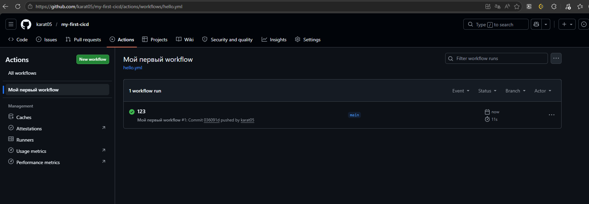

---

# 2. CI Pipeline для Python

## Создание репозитория и структуры

**Создать публичный репозиторий `my-python-app` на GitHub с `README.md`**

**Клонировать репозиторий, открыть в VS Code и выполнить:**

```bash
mkdir -p .github/workflows myapp tests && \
touch .github/workflows/ci.yml myapp/{__init__.py,app.py} \
tests/test_app.py setup.py requirements.txt Dockerfile README.md
```

## Основной код `myapp/app.py`

**Открыть `myapp/app.py` и вставить код:**

```python
def add(a: int, b: int) -> int:
    """Возвращает сумму двух чисел."""
    return a + b

def main():
    print("Hello from my Python app!")

if __name__ == "__main__":
    main()
```

## Тесты `tests/test_app.py`

```python
from myapp.app import add

def test_add():
    assert add(2, 3) == 5
    assert add(-1, 1) == 0
    assert add(0, 0) == 0
```


## Зависимости и Dockerfile

**`requirements.txt`:**

```text
pytest
flake8
```

**`Dockerfile`:**

```dockerfile
FROM python:3.11-slim
WORKDIR /app
COPY requirements.txt .
RUN pip install --no-cache-dir -r requirements.txt
COPY . .
CMD ["python", "myapp/app.py"]
```

## Workflow `.github/workflows/ci.yml`

**Открыть `ci.yml` и вставить конфиг:**

```yaml
name: CI for Python App

on:
  push:
    branches: [ main, master ]
  pull_request:
    branches: [ main, master ]

jobs:
  test:
    name: Lint & Test
    runs-on: ubuntu-latest

    strategy:
      matrix:
        python-version: ["3.9", "3.10", "3.11", "3.12"]

    steps:
      - name: Checkout code
        uses: actions/checkout@v4

      - name: Set up Python ${{ matrix.python-version }}
        uses: actions/setup-python@v5
        with:
          python-version: ${{ matrix.python-version }}

      - name: Install dependencies
        run: |
          python -m pip install --upgrade pip
          pip install flake8 pytest
          if [ -f requirements.txt ]; then pip install -r requirements.txt; fi

      - name: Install package in development mode
        run: pip install -e .

      - name: Lint with flake8
        run: |
          flake8 . --count --select=E9,F63,F7,F82 --show-source --statistics
          flake8 . --count --exit-zero --max-complexity=10 --max-line-length=127 --statistics

      - name: Test with pytest
        run: pytest tests/

  docker-build:
    name: Build Docker Image (no push)
    runs-on: ubuntu-latest
    needs: test
    if: github.event_name == 'push' && github.ref == 'refs/heads/main'

    steps:
      - name: Checkout code
        uses: actions/checkout@v4

      - name: Build Docker image
        run: docker build -t my-python-app:test .
```

## Проверить сборку онлайн


## Проверка Docker-образа локально

**Сборка образа:**

```bash
docker build -t my-python-app:test .
```

**Запуск контейнера:**

```bash
docker run --rm my-python-app:test
```

Ожидаемый вывод: `Hello from my Python app!`

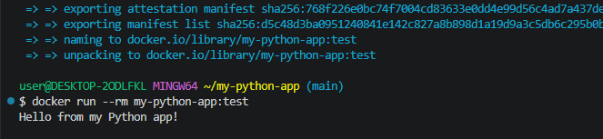

---

# 3. CI Pipeline для Node.js

## Создание репозитория и структуры

**Создать публичный репозиторий `my-node-app` на GitHub с `README.md`**

**Клонировать репозиторий и создать структуру:**

```bash
mkdir -p .github/workflows src tests && \
touch .github/workflows/ci.yml src/index.js tests/index.test.js \
package.json .eslintrc.json Dockerfile README.md
```

## `package.json`

```json
{
  "name": "my-node-app",
  "version": "1.0.0",
  "description": "Пример CI для Node.js",
  "main": "src/index.js",
  "scripts": {
    "test": "jest",
    "lint": "eslint src",
    "start": "node src/index.js"
  },
  "devDependencies": {
    "eslint": "^8.56.0",
    "jest": "^29.7.0"
  }
}
```


## Код `src/index.js`

```javascript
function add(a, b) {
    return a + b;
}
function main() {
    console.log("Hello from Node.js app!");
}
if (require.main === module) {
    main();
}
module.exports = { add };
```


## Тесты `tests/index.test.js`

```javascript
const { add } = require('../src/index');

test('adds 2 + 3 to equal 5', () => {
    expect(add(2, 3)).toBe(5);
});

test('adds -1 + 1 to equal 0', () => {
    expect(add(-1, 1)).toBe(0);
});

test('adds 0 + 0 to equal 0', () => {
    expect(add(0, 0)).toBe(0);
});
```


## Dockerfile и ESLint

**`Dockerfile`:**

```dockerfile
FROM node:18-alpine
WORKDIR /app
COPY package*.json ./
RUN npm ci --only=production
COPY . .
CMD ["node", "src/index.js"]
```

**`.eslintrc.json`:**

```json
{
  "env": {
    "node": true,
    "jest": true
  },
  "extends": "eslint:recommended",
  "parserOptions": {
    "ecmaVersion": 2021
  },
  "rules": {
    "no-unused-vars": "warn"
  }
}
```


## Workflow `.github/workflows/ci.yml`

```yaml
name: CI for Node.js App

on:
  push:
    branches: [ main, master ]
  pull_request:
    branches: [ main, master ]

jobs:
  test:
    name: Lint & Test
    runs-on: ubuntu-latest
    strategy:
      matrix:
        node-version: [18.x, 20.x, 22.x]
    steps:
      - uses: actions/checkout@v4
      - name: Use Node.js ${{ matrix.node-version }}
        uses: actions/setup-node@v4
        with:
          node-version: ${{ matrix.node-version }}
          cache: 'npm'
      - run: npm ci
      - run: npm run lint
      - run: npm test

  docker-build:
    name: Build Docker Image (no push)
    runs-on: ubuntu-latest
    needs: test
    if: github.event_name == 'push' && github.ref == 'refs/heads/main'
    steps:
      - uses: actions/checkout@v4
      - run: docker build -t my-node-app:test .
```


## Генерация `package-lock.json` через Docker

```bash
docker run --rm -v "$(pwd):/app" -w /app node:18-alpine npm install --package-lock-only
```

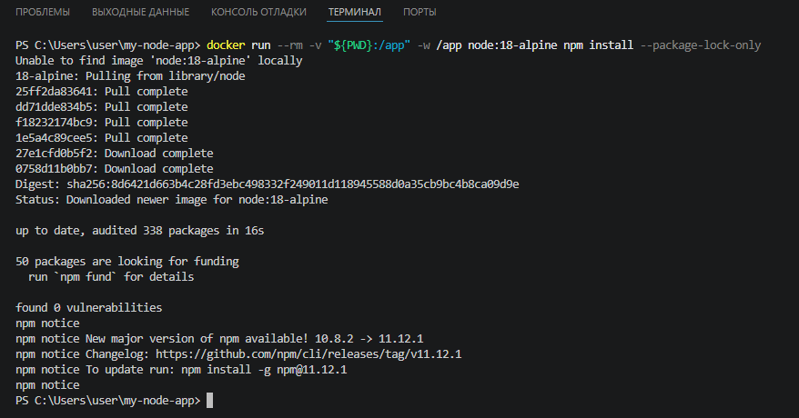


 ##  Проверить сборку онлайн

 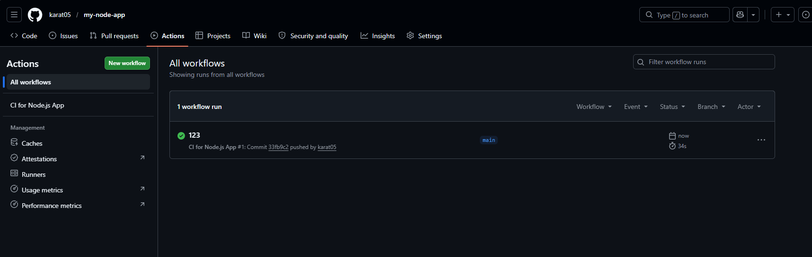


## Проверка Docker-образа локально

```bash
docker build -t my-node-app:latest .
docker run --rm my-node-app:latest
```

Ожидаемый вывод: `Hello from Node.js app!`

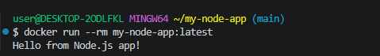

---

# 4. CI Pipeline для Go

## Создание репозитория и структуры

**Создать публичный репозиторий `my-go-app` на GitHub с `README.md`**

**Создать структуру проекта:**

```bash
mkdir -p .github/workflows && \
touch .github/workflows/ci.yml main.go sum.go sum_test.go Dockerfile README.md
```


## Инициализация Go-модуля (через Docker)

```bash
docker run --rm -v "$(pwd):/app" -w /app golang:1.22-alpine go mod init my-go-app
docker run --rm -v "$(pwd):/app" -w /app golang:1.22-alpine go mod tidy
```


## Код `sum.go` и `main.go`

```go
package main

func Sum(a, b int) int {
    return a + b
}
```

```go
package main

import "fmt"

func main() {
    fmt.Println("Hello from Go app!")
    fmt.Println("2 + 3 =", Sum(2, 3))
}
```


## Тесты `sum_test.go`

```go
package main
import "testing"

func TestSum(t *testing.T) {
    tests := []struct {
        a, b, expected int
    }{
        {2, 3, 5},
        {-1, 1, 0},
        {0, 0, 0},
    }
    for _, tt := range tests {
        result := Sum(tt.a, tt.b)
        if result != tt.expected {
            t.Errorf("Sum(%d, %d) = %d; want %d", tt.a, tt.b, result, tt.expected)
        }
    }
}
```


## Dockerfile и workflow

**`Dockerfile`:**

```dockerfile
FROM golang:1.22-alpine AS builder
WORKDIR /app
COPY go.mod .
RUN go mod download
COPY . .
RUN CGO_ENABLED=0 GOOS=linux go build -o my-app .

FROM alpine:latest
RUN apk --no-cache add ca-certificates
WORKDIR /root/
COPY --from=builder /app/my-app .
CMD ["./my-app"]
```

**`.github/workflows/ci.yml`:**

```yaml
name: CI for Go App

on:
  push:
    branches: [ main, master ]
  pull_request:
    branches: [ main, master ]

jobs:
  test:
    name: Lint & Test
    runs-on: ubuntu-latest

    steps:
      - name: Checkout code
        uses: actions/checkout@v4

      - name: Set up Go
        uses: actions/setup-go@v5
        with:
          go-version: '1.22'
          cache: true

      - name: Download dependencies
        run: go mod download

      - name: Run golangci-lint
        uses: golangci/golangci-lint-action@v6
        with:
          version: latest
          args: --timeout=5m

      - name: Run tests with coverage
        run: go test -v -coverprofile=coverage.out ./...

  docker-build:
    name: Build Docker Image (no push)
    runs-on: ubuntu-latest
    needs: test
    if: github.event_name == 'push' && github.ref == 'refs/heads/main'

    steps:
      - uses: actions/checkout@v4
      - name: Build Docker image
        run: docker build -t my-go-app:test .
```

## Запуск локальных тестов через Docker

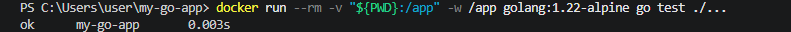


## Сборка бинарного файла локально

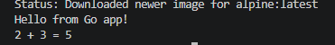


## Проверить сборку онлайн

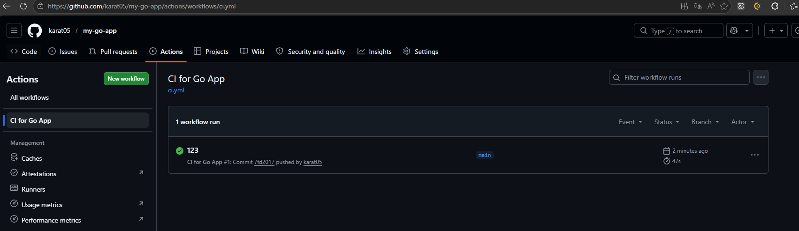


## Проверка Docker-образа

```bash
docker build -t my-go-app:latest .
docker run --rm my-go-app:latest
```

Ожидаемый вывод:

```text
Hello from Go app!
2 + 3 = 5
```

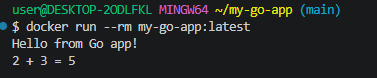

Опционально вы можете зайти в интерактивный режим контейнера для ознакомления и отладки:

docker run -it --rm my-go-app:latest /bin/sh

выполнить команду получения ин-фы об используемой в контейнере ОС

cat /etc/os-release

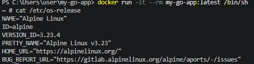

---

# 5. CI Pipeline для Rust

## Создание репозитория и структуры

**Создать публичный репозиторий `my-rust-app` на GitHub с `README.md`**

**Создать структуру проекта:**

```bash
mkdir -p .github/workflows src && \
touch .github/workflows/rust-ci.yml \
Cargo.toml Cargo.lock .dockerignore .gitignore src/main.rs \
Dockerfile README.md
```


## Cargo.toml и main.rs

```toml
[package]
name = "my-rust-app"
version = "0.1.0"
edition = "2021"

[dependencies]

[profile.release]
lto = true
codegen-units = 1
opt-level = 3
```

```rust
use std::io::{self, Write};

fn main() {
    println!("Hello from Rust in Docker!");
    io::stdout().flush().unwrap();
    std::thread::sleep(std::time::Duration::from_millis(100));
}
```


## Dockerfile и workflow

**`Dockerfile`:**

```dockerfile
FROM rust:1-slim AS builder
WORKDIR /app
COPY Cargo.toml Cargo.lock ./
RUN mkdir src && echo "fn main() {}" > src/main.rs
RUN cargo build --release && rm -f target/release/my-rust-app*
COPY src ./src
RUN cargo build --release

FROM debian:stable-slim
RUN useradd --create-home appuser
WORKDIR /home/appuser
COPY --from=builder /app/target/release/my-rust-app .
USER appuser
CMD ["./my-rust-app"]
```

**`.github/workflows/rust-ci.yml`:**

```yaml
name: Rust CI Pipeline

on:
  push:
    branches: [ main, master ]
  pull_request:
    branches: [ main, master ]
  workflow_dispatch:

env:
  CARGO_TERM_COLOR: always
  IMAGE_NAME: my-rust-app

jobs:
  lint:
    name: Lint & Format
    runs-on: ubuntu-latest
    steps:
      - name: Checkout code
        uses: actions/checkout@v4
      - name: Setup Rust
        uses: actions-rs/toolchain@v1
        with:
          profile: minimal
          toolchain: stable
          components: rustfmt, clippy
          override: true
      - name: Check formatting
        run: cargo fmt --all -- --check
      - name: Run Clippy (linter)
        run: cargo clippy -- -D warnings

  test:
    name: Build & Test
    runs-on: ubuntu-latest
    needs: lint
    steps:
      - name: Checkout code
        uses: actions/checkout@v4
      - name: Setup Rust
        uses: actions-rs/toolchain@v1
        with:
          profile: minimal
          toolchain: stable
          override: true
      - name: Check code (fast)
        run: cargo check --verbose
      - name: Check debug build
        run: cargo build --verbose
      - name: Check release build
        run: cargo build --release --verbose
      - name: Run tests
        run: cargo test --verbose

  docker-build:
    name: Build Docker Image
    runs-on: ubuntu-latest
    needs: test
    steps:
      - name: Checkout code
        uses: actions/checkout@v4
      - name: Set up Docker Buildx
        uses: docker/setup-buildx-action@v3
      - name: Build Docker image
        uses: docker/build-push-action@v5
        with:
          context: .
          load: true
          tags: ${{ env.IMAGE_NAME }}:latest
```
##  Проверить сборку онлайн

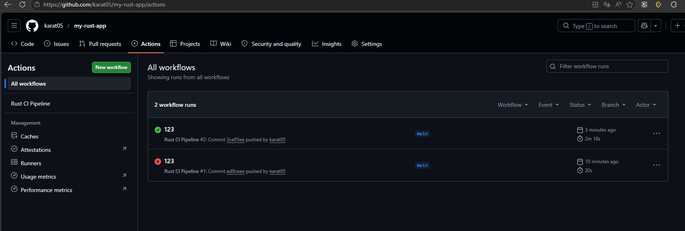

## Проверка Docker-образа

```bash
docker build -t my-rust-app:latest .
docker images | grep my-rust-app
docker run --rm my-rust-app:latest
```

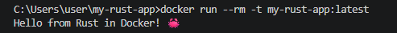

---

# 6. PHP + MySQL (заготовка)

# 🐳 PHP + MySQL Docker App + GitHub Actions CI

Проект представляет собой контейнеризированное PHP-приложение с подключением к MySQL. Включает локальную среду разработки на Docker Compose и автоматический CI/CD пайплайн через GitHub Actions.

---

## 🛠 Предварительные требования
- [Docker Desktop](https://www.docker.com/products/docker-desktop/) (включая Docker Compose v2)
- Git
- Учетная запись GitHub

---

## 📁 1. Создание структуры проекта

Выполни в терминале VS Code (PowerShell):

```powershell
# Создаем папки
New-Item -ItemType Directory -Force -Path "src\controllers", "src\models", "src\views", "tests\unit", "tests\integration", "config", "public", "logs", "docker", ".github\workflows" | Out-Null

# Создаем базовые файлы
New-Item -ItemType File -Force -Path "src\index.php", "README.md", ".gitignore", "docker-compose.yml", "Dockerfile", ".dockerignore", ".github\workflows\ci.yml" | Out-Null

Write-Host "✅ Структура создана!" -ForegroundColor Green
```

> 💡 **Альтернатива для Git Bash:**
> ```bash
> mkdir -p src/{controllers,models,views} tests/{unit,integration} config public logs docker .github/workflows
> touch src/index.php README.md .gitignore docker-compose.yml Dockerfile .dockerignore .github/workflows/ci.yml
> ```

---

## 📄 2. Содержание ключевых файлов

Скопируй этот код в соответствующие файлы проекта:

### `Dockerfile`
```dockerfile
FROM php:8.2-apache
RUN docker-php-ext-install pdo pdo_mysql
WORKDIR /var/www/html
COPY ./src /var/www/html
```

### `docker-compose.yml`
```yaml
services:
  db:
    image: mysql:8.0
    restart: always
    environment:
      MYSQL_ROOT_PASSWORD: root_password
      MYSQL_DATABASE: my_app_db
      MYSQL_USER: app_user
      MYSQL_PASSWORD: app_password
    ports: ["3306:3306"]
    healthcheck:
      test: ["CMD", "mysqladmin", "ping", "-h", "localhost"]
      timeout: 20s
      retries: 10

  app:
    build: .
    volumes:
      - ./src:/var/www/html
    depends_on:
      db:
        condition: service_healthy
    ports: ["80:80"]
    environment:
      DB_HOST: db
      DB_USER: app_user
      DB_PASSWORD: app_password
      DB_NAME: my_app_db
```

### `src/index.php`
```php
<?php
$host = getenv('DB_HOST') ?: 'db';
$user = getenv('DB_USER') ?: 'app_user';
$pass = getenv('DB_PASSWORD') ?: 'app_password';
$db   = getenv('DB_NAME') ?: 'my_app_db';

echo "<h1>PHP + MySQL в Docker</h1>";
try {
    $pdo = new PDO("mysql:host=$host;dbname=$db;charset=utf8mb4", $user, $pass);
    $pdo->setAttribute(PDO::ATTR_ERRMODE, PDO::ERRMODE_EXCEPTION);
    echo "<p style='color:green;'>✅ Подключение к базе успешно!</p>";
    echo "<p>Версия MySQL: " . $pdo->query('SELECT VERSION()')->fetchColumn() . "</p>";
} catch (PDOException $e) {
    echo "<p style='color:red;'>❌ Ошибка: " . $e->getMessage() . "</p>";
}
?>
```

### `.dockerignore`
```text
.git
.gitignore
.env
logs
README.md
docker-compose.yml
Dockerfile
```

### `.github/workflows/ci.yml`
```yaml
name: PHP + MySQL CI

on:
  push:
    branches: [ "main", "master" ]
  pull_request:
    branches: [ "main", "master" ]

jobs:
  test:
    runs-on: ubuntu-latest
    steps:
      - name: 📥 Checkout кода
        uses: actions/checkout@v4

      - name: 🐳 Сборка и запуск
        run: |
          docker compose build
          docker compose up -d

      - name: ⏱️ Ожидание БД
        run: sleep 5

      - name: 🔍 Проверка подключения
        run: |
          docker compose exec -T app php -r "
            try {
              \$pdo = new PDO('mysql:host=db;dbname=my_app_db', 'app_user', 'app_password');
              echo '✅ CI: База доступна!\n';
            } catch (PDOException \$e) {
              echo '❌ CI: Ошибка БД. ' . \$e->getMessage() . '\n';
              exit(1);
            }
          "

      - name: 📜 Логи при ошибке
        if: failure()
        run: docker compose logs
```

---

## 🚀 3. Запуск локально

```powershell
# Сборка и запуск в фоне
docker compose up -d --build

# Проверка статуса контейнеров
docker compose ps

# Открыть в браузере: http://localhost
# Ожидаемый результат: ✅ Подключение к базе успешно!

# Просмотр логов в реальном времени
docker compose logs -f app
```

---

## 🐋 4. Проверка и управление Docker-образами

### 🔹 Локально (PowerShell)

| Команда | Описание |
|--------|----------|
| `docker images` | Список всех образов на ПК |
| `docker images \| Select-String "my-app"` | Найти образ по имени (PowerShell аналог grep) |
| `docker compose images` | Список образов **только** текущего проекта |
| `docker history <image_name>` | История слоев (как собирали) |
| `docker inspect --format='{{.Config.Cmd}}' <image_name>` | Узнать команду запуска образа |
| `docker system df` | Сколько места занимают образы |
| `docker image prune -a` | Удалить все неиспользуемые образы |

### 🔹 Онлайн (Docker Hub)

Если ты хочешь выгрузить образ в реестр:

```bash
# 1. Авторизация
docker login

# 2. Смена тега (указываем никнейм на DockerHub)
docker tag my-php-app:latest твой_ник/my-php-app:latest

# 3. Пуш в реестр
docker push твой_ник/my-php-app:latest
```

Проверить результат можно по ссылке: `https://hub.docker.com/r/твой_ник/my-php-app`

---

## 🔄 5. GitHub Actions CI/CD

После пуша кода на GitHub пайплайн запустится автоматически.

**Как проверить онлайн:**
1. Перейди в репозиторий → вкладка **Actions**.
2. Кликни на последний запуск (например, `PHP + MySQL CI`).
3. Разверни шаги `🐳 Сборка и запуск` и `🔍 Проверка подключения`.

> ⚠️ **Важно:** Actions запустится только если файл лежит строго по пути `.github/workflows/ci.yml` и ветка совпадает с настройками (`main` или `master`).


## Все образы собрались 

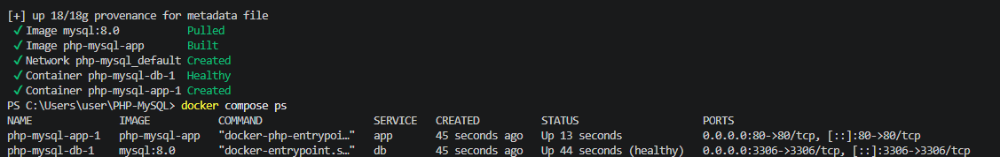


## Проверить сборку локально 

Открой в браузере
Перейди по ссылке: http://localhost

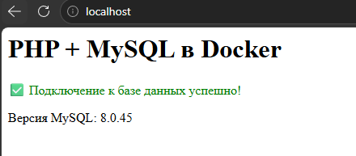


## Проверить сборку онлайн

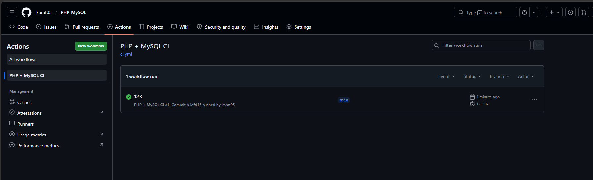
---

# 7. C++ 

# 🐳 C++ Docker App + GitHub Actions CI

Контейнеризированное C++-приложение с многоэтапной сборкой. Включает локальную среду на Docker Compose и автоматический CI/CD пайплайн через GitHub Actions.

---

## 🛠 Предварительные требования
- [Docker Desktop](https://www.docker.com/products/docker-desktop/) (включая Docker Compose v2)
- Git
- Учетная запись GitHub

---

## 📁 1. Создание структуры проекта

Выполни в терминале VS Code (PowerShell):

```powershell
# Создаем папки
New-Item -ItemType Directory -Force -Path "src", "tests", "config", "build", ".github\workflows" | Out-Null

# Создаем базовые файлы
New-Item -ItemType File -Force -Path "src\main.cpp", "README.md", ".gitignore", "docker-compose.yml", "Dockerfile", ".dockerignore", ".github\workflows\ci.yml" | Out-Null

Write-Host "✅ Структура создана!" -ForegroundColor Green
```

> 💡 **Альтернатива для Git Bash:**
> ```bash
> mkdir -p src tests config build .github/workflows
> touch src/main.cpp README.md .gitignore docker-compose.yml Dockerfile .dockerignore .github/workflows/ci.yml
> ```

---

## 📄 2. Содержание ключевых файлов

Скопируй этот код в соответствующие файлы проекта:

### `Dockerfile`
```dockerfile
# ---- Этап 1: Сборка ----
FROM gcc:13-bookworm AS builder
WORKDIR /app
COPY src ./src
RUN g++ -o my-cpp-app src/main.cpp -std=c++17 -O2 -Wall

# ---- Этап 2: Запуск (тот же образ для совместимости библиотек) ----
FROM gcc:13-bookworm
WORKDIR /app
COPY --from=builder /app/my-cpp-app .
CMD ["./my-cpp-app"]
```

### `docker-compose.yml`
```yaml
services:
  app:
    build: .
    container_name: cpp-app
    restart: "no"
```

### `src/main.cpp`
```cpp
#include <iostream>
#include <thread>
#include <chrono>

int main() {
    std::cout << "✅ Hello from C++ in Docker!" << std::endl;
    std::cout << "🚀 Container is running successfully." << std::endl;
    
    // Небольшая задержка для гарантии вывода в контейнере
    std::this_thread::sleep_for(std::chrono::milliseconds(100));
    return 0;
}
```

### `.dockerignore`
```text
.git
.gitignore
.env
logs
README.md
docker-compose.yml
Dockerfile
build/
*.o
```

### `.github/workflows/ci.yml`
```yaml
name: C++ Docker CI

on:
  push:
    branches: [ "main", "master" ]
  pull_request:
    branches: [ "main", "master" ]

jobs:
  test:
    runs-on: ubuntu-latest
    steps:
      - name: 📥 Checkout кода
        uses: actions/checkout@v4

      - name: 🐳 Сборка образа
        run: docker build -t my-cpp-app:latest .

      - name: 🚀 Запуск контейнера
        run: docker run --name cpp-test my-cpp-app:latest

      - name: ✅ Проверка вывода
        run: |
          OUTPUT=$(docker logs cpp-test 2>&1)
          docker rm cpp-test
          
          if echo "$OUTPUT" | grep -q "Hello from C++"; then
            echo "✅ CI Test: Приложение работает корректно!"
          else
            echo "❌ CI Test: Ожидаемый вывод не найден."
            echo "$OUTPUT"
            exit 1
          fi

      - name: 📜 Логи при ошибке
        if: failure()
        run: docker logs cpp-test || true
```

---

## 🚀 3. Запуск локально

```powershell
# Сборка и запуск в фоне
docker compose up -d --build

# Проверка статуса контейнера
docker compose ps

# Просмотр вывода приложения
docker compose logs app

# Ожидаемый результат в логах:
# ✅ Hello from C++ in Docker!
# 🚀 Container is running successfully.
```

---

## 🐋 4. Проверка и управление Docker-образами

### 🔹 Локально (PowerShell)

| Команда | Описание |
|--------|----------|
| `docker images` | Список всех образов на ПК |
| `docker images \| Select-String "my-cpp-app"` | Найти образ по имени (PowerShell аналог grep) |
| `docker compose images` | Список образов **только** текущего проекта |
| `docker history my-cpp-app:latest` | История слоев (как собирали) |
| `docker inspect --format='{{.Config.Cmd}}' my-cpp-app:latest` | Узнать команду запуска образа |
| `docker system df` | Сколько места занимают образы |
| `docker image prune -a` | Удалить все неиспользуемые образы |

### 🔹 Онлайн (Docker Hub)

Если ты хочешь выгрузить образ в реестр:

```bash
# 1. Авторизация
docker login

# 2. Смена тега (указываем никнейм на DockerHub)
docker tag my-cpp-app:latest твой_ник/my-cpp-app:latest

# 3. Пуш в реестр
docker push твой_ник/my-cpp-app:latest
```

Проверить результат можно по ссылке: `https://hub.docker.com/r/твой_ник/my-cpp-app`

---

## 🔄 5. GitHub Actions CI/CD

После пуша кода на GitHub пайплайн запустится автоматически.

**Как проверить онлайн:**
1. Перейди в репозиторий → вкладка **Actions**.
2. Кликни на последний запуск (например, `C++ Docker CI`).
3. Разверни шаги `🚀 Запуск контейнера` и `✅ Проверка вывода`.

> ⚠️ **Важно:** Actions запустится только если файл лежит строго по пути `.github/workflows/ci.yml` и ветка совпадает с настройками (`main` или `master`).

---

## 📝 6. Если возникли проблемы

### Ошибка GLIBCXX (версия библиотеки не найдена)
Используй **один и тот же образ** для сборки и запуска (как в Dockerfile выше) или статическую линковку:
```dockerfile
RUN g++ -static -o my-cpp-app src/main.cpp -std=c++17 -O2
```

### Docker Desktop упал с SIGBUS
1. Перезапусти Docker Desktop
2. Очисти место на диске C: (минимум 20 GB свободно)
3. Выполни: `docker system prune -a --volumes -f`

### Actions не запускается
- Проверь путь: `.github/workflows/ci.yml`
- Убедись, что ветка называется `main` или `master`
- В настройках репо: Settings → Actions → General → Allow all actions

---


## проврка логов докер образов
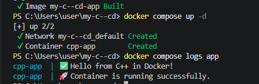


## Проверить сборку онлайн

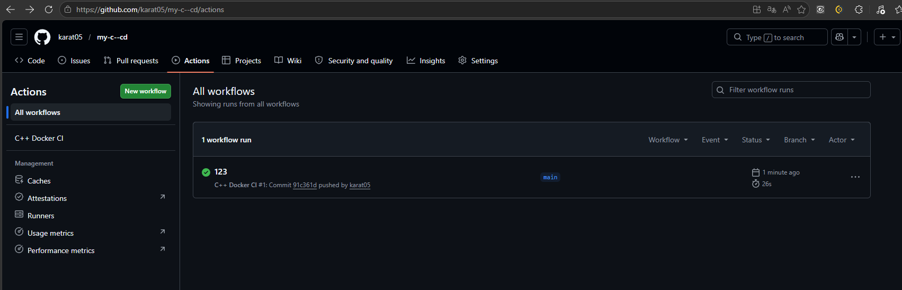
---

Если вы обнаружили ошибку в этом тексте - сообщите пожалуйста автору!
